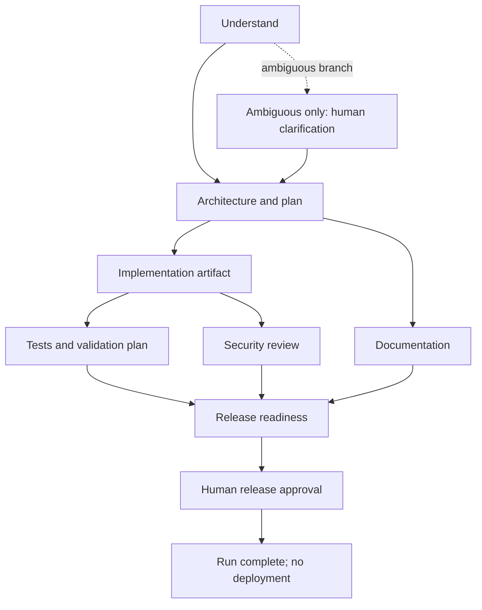

# Architecture and Controls

## Components

- ASP.NET Core minimal API exposes link creation, redirect, analytics, workflow control, and health routes.
- `ShortLinkService` validates destination/expiry policy and coordinates `IShortLinkRepository`.
- `JsonShortLinkRepository` serializes access in-process and writes snapshots through a temporary file followed by atomic replacement. It retains a lifetime click count and up to 1,000 recent click timestamps for 30-day daily analytics.
- `WorkflowOrchestrator` owns the dependency graph, run state, approval decisions, audit events, bounded retry policy, fallback, cancellation, replan, and aggregate metrics.
- ASP.NET Core JWT bearer authentication validates tokens against a configured HTTPS OIDC authority and audience. Workflow routes enforce distinct `workflow.read`, `workflow.execute`, `workflow.approve`, or `workflow.operator` permissions from `scope`, `scp`, or `roles` claims. Audit actors come from the validated `sub` claim; without issuer/audience configuration, workflow routes fail closed.
- `IStageAgent` is a replaceable agent boundary. `RuleBasedStageAgent` emits deterministic, inspectable stage artifacts. An optional OpenAI-compatible chat adapter is enabled only by explicit configuration; it has no tools or shell access and requires HTTPS outside loopback. Both agents are constrained to artifacts and remain behind the same gates.

## Orchestration graph

The scheduler selects all currently-ready non-gated nodes and executes up to three concurrently. A gate pauses the run and records its stage, actor, rationale, timestamp, and plan revision. Replanning increments the revision, clears all derived stage outputs, invalidates prior approvals, records the reason, and recomputes from requirement understanding. Retry budget is three attempts per stage. Exhausted documentation generation uses a marked fallback; other exhausted stages fail closed. Safe-stop cancels in-flight work; resume continues from completed stages. Rollback clears generated in-memory artifacts and records the operator decision. Since this prototype has no external side effects, rollback is workflow-state cleanup, not a distributed transaction or deployment rollback.

## Reliability and policy

The metrics endpoint reports terminal-run success rate, retry count, rollback count, recovered-run mean time to recovery, and mean end-to-end latency. Audit and decisions are returned with each run. Inputs are bounded; destination URLs must be absolute HTTP(S), credentials in URLs are rejected, and writes are rate-limited. Short-link and health routes remain public; workflow APIs require authenticated permissions.

The model/agent boundary cannot deploy, invoke tools, or mutate the repository. Human approval is mandatory before ambiguous work proceeds and before any run is marked complete. This remains a prototype: immutable audit storage, PII review, tenant isolation, durable workflow state, distributed locking, provider integration tests, and real rollback adapters are required before deployment. The configured identity provider and token issuance policies are trusted; the application does not provision users or enforce separation of duties between approver and requester.